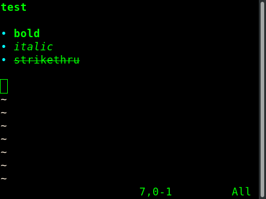

This is a fork with only a minor feature add from the original [xolox/vim-notes]: https://github.com/xolox/vim-notes 

The added feature is the ability to format text as strikethrough using two tildes (~~) as the start and end of the highlight sequence

Due to a conflict I couldn't resolve, I disabled the notesUnixPath syntax (which also used tilde)

